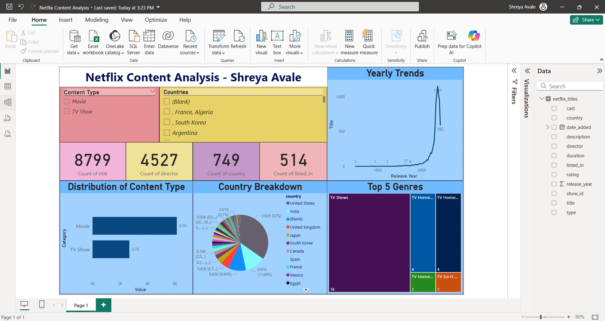

# 📊 Netflix Data Analysis

This project explores Netflix’s publicly available dataset to uncover insights about the platform’s content, trends over time, and global reach. Using Python and data visualization libraries, we analyze the types of shows and movies available, their distribution over years, and the most popular genres.

---

## 📁 Dataset

- Source: [Kaggle - Netflix Titles](https://www.kaggle.com/shivamb/netflix-shows)
- File used: `netflix_titles.csv`

---

## 🛠️ Tools & Libraries Used

- Python (pandas, numpy, seaborn, matplotlib)
- Jupyter Notebook

---

## 🔍 Objectives

- Explore the dataset and clean missing/null values
- Understand trends in content types (Movies vs TV Shows)
- Identify top countries contributing to Netflix’s content
- Analyze genre popularity and yearly release trends
- Create compelling visualizations for better insight

---

## 📈 Key Insights

- Netflix saw a sharp increase in content post-2015
- Movies make up the majority of the content
- The United States contributes the highest number of titles
- Drama and Comedy are the most common genres
- Most content is recent (post-2010)

---

## 📎 Project Structure

netflix-analysis/
├── netflix_analysis.ipynb # Main notebook with analysis and visualizations
├── netflix_titles.csv # Dataset
├── Dashboard.png # Power BI dashboard screenshot
├── Report_Image.png # Additional Power BI visual/report
└── README.md # Project overview

---

## 📊 Power BI Dashboard

To complement the data analysis, I created a Power BI dashboard highlighting key insights:

---

## 💡 Future Scope

- Use NLP to analyze title/description trends
- Compare Netflix with other streaming platforms

---

## 🔗 GitHub Repo Link 

[https://github.com/melomaniac184/netflix-data-analysis](https://github.com/melomaniac184/netflix-data-analysis)
